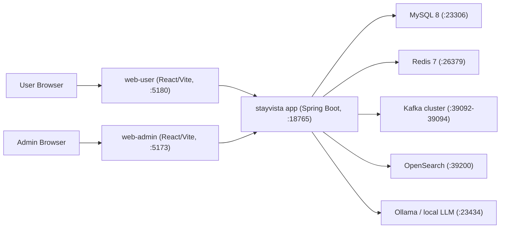
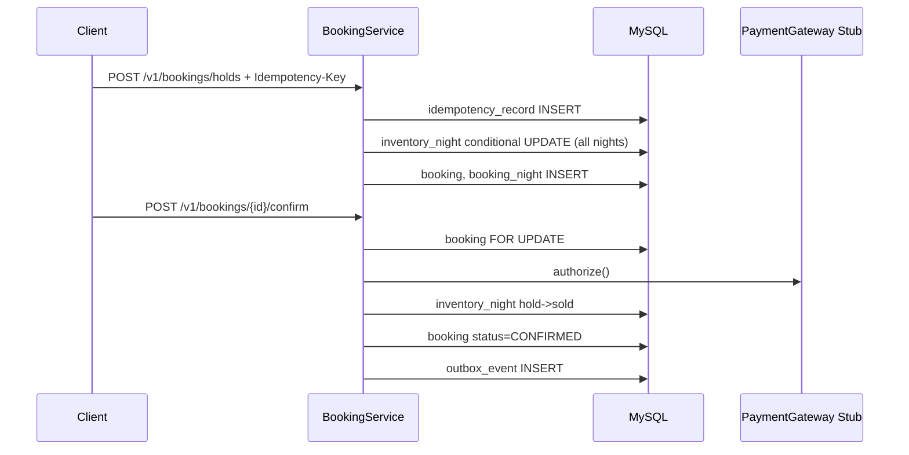

# StayVista Technical Guide

이 문서는 StayVista 모노레포를 처음 보는 개발자가 "무엇이 어디에 있고, 어떤 흐름으로 동작하며, 지금 구조가 어디까지 구현되어 있는지"를 빠르게 파악할 수 있도록 정리한 통합 기술문서다.

기준 시점:
- 코드베이스 직접 스캔 기준
- 현재 동작 기준 앱: 루트 `src/`의 Spring Boot 애플리케이션
- 참고 문서: `README.md`, `ARCHITECTURE.md`, `RUNBOOK.md`, `API_SURFACE.md`, `contracts/openapi-v1.yaml`

## 1. 한눈에 보는 프로젝트

StayVista는 OTA 스타일 여행 플랫폼을 지향하는 모노레포다. 현재 구현 범위는 숙소 검색/상세/예약, 티켓/체험, 패키지, 프로모션, 주변 POI, AI 추천/챗봇, 운영자 콘솔까지 포함한다.

핵심 포인트:
- 현재 실제 런타임은 "단일 Kotlin/Spring Boot 앱 + 두 개의 React 앱" 구조다.
- `services/` 디렉터리는 멀티모듈/마이크로서비스 분리 방향을 위한 스캐폴딩과 보조 자산을 담고 있다.
- 정합성은 DB 원자 업데이트와 트랜잭션으로 보장하려는 방향이 코드에 비교적 충실하게 반영되어 있다.
- AI 기능은 부가 기능이 아니라 검색/추천 UX의 중심축 중 하나로 구현되어 있다.

현재 코드베이스 대략 규모:
- Kotlin main 파일: 122개
- Kotlin test 파일: 47개
- Flyway migration: 15개
- `web-user` 소스 파일: 34개
- `web-admin` 소스 파일: 13개
- `@RequestMapping` 기준 컨트롤러: 30개

## 2. 현재 실제 런타임 아키텍처



중요한 현실:
- `ARCHITECTURE.md`에서는 `api-gateway`, `catalog-service`, `booking-service` 등으로 분리된 구조를 설명한다.
- 하지만 현재 코드 기준으로는 해당 도메인들이 루트 Spring Boot 앱 안에 함께 들어 있다.
- 즉, 문서상 "목표 아키텍처"와 실제 "현재 구현 아키텍처"는 다르다.

## 3. 레포 구조

| 경로 | 역할 | 현재 상태 |
| --- | --- | --- |
| `src/` | 실제 동작 중인 Kotlin/Spring Boot 앱 | 핵심 구현부 |
| `web-user/` | 사용자용 React 앱 | 실제 사용 |
| `web-admin/` | 운영자용 React 앱 | 실제 사용 |
| `db/migration/` | 루트 앱 Flyway SQL | 실제 사용 |
| `services/` | 멀티모듈 스캐폴딩, eval, loadtest, LLM infra | 부분 사용 |
| `contracts/` | OpenAPI 계약 문서 | 부분 사용, 실제 API보다 범위가 좁음 |
| `tasks/done/` | 완료 티켓 히스토리 | 기능 연혁 파악에 유용 |
| `docs/` | 운영/지도/기타 문서 | 보조 문서 |
| `scripts/` | 로컬 개발/시드 스크립트 | 실제 사용 |

권장 읽기 순서:
1. 이 문서
2. `README.md`
3. `ARCHITECTURE.md`
4. `RUNBOOK.md`
5. `src/main/kotlin/com/devoceanblue/stayvista`
6. `web-user/src/App.tsx`, `web-admin/src/App.tsx`

## 4. 기술 스택

### 백엔드
- Java 21
- Kotlin 2.2.21
- Spring Boot 4.0.2
- Spring Web MVC
- Spring Data Redis
- Spring Kafka
- Flyway
- Micrometer + Prometheus
- MySQL 8
- OpenSearch 2.x

### 프론트엔드
- React 19
- React Router 7
- Vite 6
- TypeScript 5.6
- MapLibre GL

### AI / 검색 / 운영 보조
- Ollama 기반 로컬 LLM
- 임베딩 모델 `bge-m3`
- k6 부하테스트
- 자체 Eval Harness

중요한 구현상 특징:
- 의존성에는 JPA/MyBatis가 선언되어 있지만, 현재 애플리케이션 코드는 대부분 `JdbcTemplate` + `TransactionTemplate` 중심이다.
- 실제 코드에서 `@Entity`, `JpaRepository`, `@Mapper` 사용은 보이지 않는다.

## 5. 백엔드 구조

### 5.1 부트스트랩과 공통 레이어

루트 앱 진입점:
- `src/main/kotlin/com/devoceanblue/stayvista/StayvistaApplication.kt`

핵심 공통 계층:
- `RequestIdFilter`
  - 모든 요청에 `request_id`를 부여하고 응답 헤더에도 내려준다.
- `AuthGuardFilter`
  - 공개 API, 사용자 인증 API, 관리자 API를 구분한다.
  - 사용자 인증은 Bearer 토큰을 Redis 세션에서 검증한다.
  - 관리자 인증은 `X-Admin-Id` 숫자 헤더 기반의 단순 스텁이다.
- `TrafficGuardFilter`
  - 요청별 rate limit, nearby 전용 제한, queue token 검증을 수행한다.
- `GlobalExceptionHandler`
  - 도메인 예외를 공통 에러 포맷으로 변환한다.
- `ApiResponses`
  - 응답은 현재 `request_id` + `data/error` 형태다.

현재 구현과 설계 문서의 차이:
- AGENTS/ARCHITECTURE 문서에는 `trace_id`, `server_time`, gateway 노출 원칙이 적혀 있다.
- 현재 구현 응답 envelope는 `request_id`만 포함한다.
- 별도 gateway 서비스도 아직 분리되어 있지 않다.

### 5.2 도메인 패키지 개요

| 도메인 | 주요 클래스 | 역할 |
| --- | --- | --- |
| `auth` | `AuthService`, `RedisSessionService` | 회원가입/로그인/로그아웃, Redis 세션 |
| `catalog` | `CatalogService`, `HomeContentService`, `PropertyContentService` | 숙소/객실/홈 콘텐츠/숙소 상세 콘텐츠 |
| `search` | `SearchService`, `SearchFacetService`, `PriceCalendarService`, `SearchIndexSyncService` | 검색, facet, 가격 캘린더, OpenSearch 동기화 |
| `booking` | `BookingService` | 숙소 hold/confirm/cancel/expire |
| `ticket` | `TicketService`, `TicketVoucherIssueJob` | 티켓 상품/이벤트/재고/주문/바우처 |
| `packagee` | `PackageService` | 숙소+티켓 패키지 hold/confirm 보상 흐름 |
| `poi` | `PoiService` | 주변 검색, 상세, 관리자 CRUD |
| `promotion` | `PromotionService` | 홈 프로모션 조회, 쿠폰 발급 |
| `chat` | `ChatService`, `ChatCopilotOrchestratorService`, `RagIndexBuilderService` | AI 추천, SSE 스트리밍, 오케스트레이션, RAG |
| `autocomplete` | `AutocompleteService`, `AutocompleteAggregationJob` | 자동완성, 피드백 집계 |
| `locale` | `LocaleService` | 국가/통화/언어 추론 및 저장 |
| `fx` | `FxService` | 환율 조회/변환 |
| `queue` | `QueueService` | 가상 대기열 |
| `support` | `CustomerInquiryService` | 고객 문의 |
| `me` | `MyReservationService` | 내 예약, 세션 프로브 |
| `outbox` | `OutboxRelayJob` | outbox relay + Kafka publish |

## 6. 핵심 비즈니스 흐름

### 6.1 숙소 예약 흐름

숙소 예약은 이 프로젝트에서 가장 "원칙이 잘 드러나는" write path다.

핵심 구현:
- hold: `BookingService.createHold`
- confirm: `BookingService.confirm`
- cancel: `BookingService.cancel`
- expire batch: `BookingService.expireHoldsBatch`

동작 방식:
1. 사용자가 `POST /v1/bookings/holds` 호출
2. `IdempotencyService`가 `idempotency_record`에 요청을 등록
3. 날짜 구간별로 `inventory_night`에 조건부 `UPDATE` 수행
4. 모든 날짜가 성공하면 `booking`, `booking_night` 생성
5. confirm 시 `FOR UPDATE`로 booking row 잠금
6. 결제 스텁 승인 후 `hold -> sold` 전환
7. 상태를 `CONFIRMED`로 바꾸고 outbox 이벤트 적재

정합성 포인트:
- `inventory_night`는 `(room_type_id, stay_date)` PK
- hold 시 `hold + sold + 요청수량 <= total` 조건부 갱신
- confirm/cancel/expire 시 반대 방향으로 수치 복원
- expired hold를 재사용하거나 즉시 정리하는 로직이 있다



### 6.2 티켓/체험 흐름

핵심 구현:
- 상품/이벤트/재고 관리: `TicketService`
- 바우처 발급: `TicketVoucherIssueJob`

동작 방식:
1. 운영자가 티켓 상품과 이벤트를 생성
2. `ticket_inventory`에서 hot key 재고를 관리
3. hold 시 `hold + sold + qty <= total` 조건부 갱신
4. confirm 시 결제 후 `hold -> sold` 전환
5. outbox에 `VoucherIssueRequested` 발행
6. `TicketVoucherIssueJob`이 outbox를 읽어 `voucher` 행을 발급

특징:
- 바우처 발급은 주문 confirm 트랜잭션 내부가 아니라 후속 job으로 분리돼 있다.
- voucher job은 동일 주문에 대해 이미 발급된 수량을 확인해 멱등적으로 동작한다.

### 6.3 패키지 흐름

`PackageService`는 독립 재고 엔진이 아니라, 숙소 예약과 티켓 주문을 조합하는 조정자다.

hold:
- 패키지 주문 행 생성
- 숙소 hold 호출
- 티켓 hold 호출
- 한쪽 실패 시 다른 한쪽을 보상 취소

confirm:
- 패키지 주문 잠금
- 숙소 confirm
- 티켓 confirm
- 티켓 confirm 실패 시 숙소 cancel로 보상

의미:
- 패키지 도메인은 아직 완전한 saga 인프라라기보다 "서비스 레벨 오케스트레이션 + 보상" 형태다.

### 6.4 프로모션/쿠폰 발급

핵심 구현:
- `PromotionService.listCampaigns`
- `PromotionService.claimCampaign`

동작 방식:
- `promotion_campaign`은 발급 가능 수량, 발급 기간, 표시 우선순위를 관리
- `promotion_coupon_claim`은 `(campaign_id, user_id)` unique key로 중복 발급을 막는다
- 캠페인 발급 카운트는 `UPDATE ... issued_count = issued_count + 1 ... issued_count < issue_limit`로 증가

즉:
- 사용자 중복 발급은 unique key
- 전체 소진 처리와 카운트 증가는 조건부 update

### 6.5 검색 / 가격 캘린더 / 자동완성

#### 검색
- `SearchService`가 메인 엔진
- 가능한 조건이 단순할 때는 OpenSearch를 사용
- 필터가 복잡하거나 OpenSearch가 비면 DB fallback
- 응답은 10초 TTL의 in-memory cache(`SimpleTtlCache`)도 사용

중요한 구현 사실:
- OpenSearch는 보조 가속기 역할이다.
- 고급 필터 대부분은 여전히 DB SQL이 기준 구현이다.

#### 가격 캘린더
- `PriceCalendarService`
- `city_day_min_price` 우선 조회
- 없으면 `property`/`room_type` 기반 최소가 fallback
- 통화는 `FxService`로 KRW 기준 변환

#### 자동완성
- `AutocompleteService`
- OpenSearch 우선, 실패 시 DB fallback
- empty query는 recent + popular 조합
- 피드백 이벤트는 outbox에 기록되고 `AutocompleteAggregationJob`이 7일 집계 갱신

### 6.6 홈/숙소 콘텐츠

StayVista는 단순 catalog API만 있는 구조가 아니라, 홈 편집 데이터와 숙소 상세 편집 데이터를 DB에서 관리한다.

관련 테이블:
- 홈: `home_hero`, `home_hero_metric`, `home_quick_filter`, `home_destination_card`, `promotion_section`
- 숙소 상세: `property_editorial`, `property_highlight`, `property_gallery_image`, `property_staycation_card`, `room_type_media`, `room_rate_plan`, `room_rate_plan_benefit`

즉, 홈/상세 페이지의 많은 텍스트/비주얼 요소가 코드 하드코딩이 아니라 DB backing으로 이동해 있다.

### 6.7 POI / Nearby 지도

핵심 구현:
- `PoiService`
- `NearbyTokenBucketRateLimiter`

기능:
- bbox 중심 nearby 검색
- geohash prefix 기반 후보 압축
- 거리/인기/평점 정렬
- nearby 전용 캐시
- nearby 전용 레이트 리밋
- 관리자 CRUD와 geohash backfill 지원

### 6.8 AI / Chat / Concierge

AI 쪽은 단일 엔드포인트 하나가 아니라 여러 계층으로 나뉜다.

주요 구성:
- `ChatService`
  - 일반 추천 응답
  - SSE 스트리밍 응답
- `ChatRoutingPolicy`
  - 슬롯 추출, 룰/템플릿/LLM 경로 결정
- `ChatSearchHandoffAdvisor`
  - 검색 handoff 판단
- `ChatCopilotOrchestratorService`
  - 검색, 가격캘린더, 숙소상세, 가용성 확인 같은 툴형 호출을 조합
- `RagIndexBuilderService`
  - property/ticket/package/poi를 travel_doc 기반 RAG 인덱스로 구축
- `ChatMemoryService`, `PreferenceProfileService`, `SemanticCacheService`
  - 세션 메모리, 선호도 누적, 의미 유사 캐시

현실적인 해석:
- 이 프로젝트의 AI는 단순 챗봇이 아니라 검색 UI와 양방향으로 연결된 추천 보조 엔진이다.
- 특히 `web-user/src/components/chat/ConciergeDock.tsx`가 3,257라인으로 가장 큰 프론트 파일 중 하나이며, handoff/clarify/telemetry가 모두 모여 있다.

## 7. 데이터 저장소별 역할

### 7.1 MySQL

중심 저장소이며 거의 모든 도메인의 source of truth다.

주요 테이블 묶음:
- 계정/권한: `user_account`, `partner_account`
- 숙소: `property`, `room_type`, `inventory_night`, `booking`, `booking_night`
- 티켓: `product`, `ticket_event`, `ticket_inventory`, `ticket_order`, `voucher`
- 패키지: `package_product`, `package_product_component`, `package_order`
- 공통 인프라: `idempotency_record`, `outbox_event`
- 검색/분류/추천: `district`, `city_poi_popular`, `city_featured_property`, `property_type`, `amenity`, `theme`, `brand`, `property_*`
- 로케일/환율/캘린더: `session_locale`, `user_locale`, `fx_rate`, `city_day_min_price`
- AI/RAG: `travel_doc`, `travel_doc_chunk`, `travel_doc_vec`, `chat_prompt_template`, `chat_experiment`, `chat_shadow_*`, `chat_curation_rule`
- 콘텐츠/리뷰/프로모션: `property_review`, `property_review_tag`, `promotion_campaign`, `promotion_coupon_claim`, `home_*`, `property_*`
- 지원: `customer_inquiry`

### 7.2 Redis

용도:
- 로그인 세션 저장
- rate limiting
- queue waiting/admitted state
- autocomplete cache / recent
- chat cache / memory / preference / widget snapshot

특징:
- 인증 토큰은 JWT가 아니라 Redis-backed opaque token(`svs_...`)이다.
- Redis 장애 시 rate limiter는 fail-open 성격을 가진다.

### 7.3 Kafka

현재 사용 방식:
- outbox relay가 `stayvista.events` 토픽으로 publish
- 후속 처리의 흔적은 있으나, 현재 주요 소비자는 같은 앱 내부 배치/잡 성격이 강하다

즉:
- "이벤트 기반 구조의 뼈대"는 이미 존재하지만, 아직 외부 독립 consumer가 대규모로 분리된 상태는 아니다.

### 7.4 OpenSearch

역할:
- 숙소 검색 가속
- 자동완성 후보 검색

특징:
- 인덱스 자동 보장 job(`SearchIndexSyncService.ensureIndex`)
- alias 기반 upsert
- 실패 시 DB fallback 존재

### 7.5 Local LLM / Ollama

역할:
- 챗봇 생성
- 임베딩 생성

기본 모델:
- chat: `llama3.1:8b`
- embed: `bge-m3`

운영 특징:
- healthz / readyz / warmup / swap-model 스크립트 제공
- 예산 제어, concurrency gate, queue wait, degrade 정책이 설정값으로 노출됨

## 8. 프론트엔드 구조

### 8.1 사용자 웹 (`web-user`)

라우트:
- `/`
- `/search`
- `/properties/:id`
- `/tickets`, `/tickets/:id`
- `/packages`, `/packages/:id`
- `/nearby`
- `/chat`
- `/login`
- `/my/reservations`
- `/checkout/booking`
- `/checkout/ticket`
- `/checkout/package`
- `/booking/complete`
- `/support`

구조적 특징:
- 별도 전역 상태 라이브러리 없이 React state + URL query + localStorage 중심
- 인증은 브라우저에 bearer token 저장 후 API client가 자동 첨부
- locale/currency/language는 별도 context 사용
- AI concierge dock가 전체 앱 하단에 상주

파일 관점 핵심:
- `App.tsx`: 사용자 앱 라우팅과 헤더
- `SearchPage.tsx` (1,190라인): 검색 필터/URL 동기화 중심
- `PropertyPage.tsx` (1,414라인): 숙소 상세, 리뷰, FX, nearby, booking 진입
- `NearbyPage.tsx` (1,240라인): 지도 기반 탐색 UI
- `ConciergeDock.tsx` (3,257라인): AI 위젯 핵심

### 8.2 운영자 웹 (`web-admin`)

라우트:
- `/admin/properties`
- `/admin/properties/:id`
- `/admin/inventory`
- `/admin/tickets`
- `/admin/packages`
- `/admin/poi`
- `/admin/vouchers`
- `/admin/ops`

특징:
- 로그인 개념은 실질적으로 `X-Admin-Id` 값을 localStorage에 저장하는 수준
- 실제 운영자 보안/RBAC보다는 내부 운영 도구 성격이 강하다
- 검색 재색인, POI 관리, 큐레이션 규칙 관리 같은 운영 액션이 포함된다

## 9. 배치 / 스케줄 작업

현재 `@Scheduled` 기반 잡이 많다. 운영 이해에 중요하다.

| 작업 | 주기 | 역할 |
| --- | --- | --- |
| `BookingService.expireHoldsBatch` | 60초 | 만료 숙소 hold 회수 |
| `TicketService.expireTicketHolds` | 60초 | 만료 티켓 hold 회수 |
| `OutboxRelayJob.relay` | 5초 | outbox publish + 검색 동기화 |
| `TicketVoucherIssueJob.issueRequestedVouchers` | 5초 | 바우처 발급 |
| `SearchIndexSyncService.ensureIndex` | 60초 | OpenSearch 인덱스 보장 |
| `RagIndexBuilderService.scheduledIncrementalBuild` | 기본 5분 | RAG 증분 인덱싱 |
| `AutocompleteAggregationJob.aggregate` | 기본 10분 | 자동완성 피드백 집계 |

의미:
- 이 시스템은 "HTTP 요청만 보면 안 되고, 후속 잡까지 봐야 전체 동작이 보이는 구조"다.

## 10. 테스트 / 검증 / 운영 자산

### 단위/통합 테스트
테스트는 도메인별로 비교적 고르게 분포한다.

대표 범위:
- booking/ticket/package
- search/facet/opensearch fallback
- poi/nearby rate limit
- chat routing/budget/cache/memory/safety
- autocomplete
- idempotency/db retry/filter

### Eval Harness
경로:
- `services/eval`

역할:
- golden dataset 기반 chat 품질 자동 채점

지표:
- slot accuracy
- citation coverage
- safety violation rate
- route stability
- latency p95/p99

### Load Test
경로:
- `services/loadtest`

시나리오:
- 검색
- 가격 캘린더
- booking hold spike
- 전체 퍼널
- chat / chat stream
- nearby map drag
- autocomplete

### 운영 문서
- `RUNBOOK.md`
- `docs/runbooks/STAYVISTA_PROD_PARITY_2026.md`
- `docs/maps/README.md`

## 11. 로컬 실행 방법

### 인프라
```bash
./scripts/dev.sh
```

포트:
- MySQL: `23306`
- Redis: `26379`
- Kafka: `39092`, `39093`, `39094`
- OpenSearch: `39200`

### 백엔드
```bash
./gradlew bootRun
```

포트:
- API: `18765`

### 사용자 웹
```bash
npm --prefix web-user install
npm --prefix web-user run dev
```

포트:
- `5180`

### 운영자 웹
```bash
npm --prefix web-admin install
npm --prefix web-admin run dev
```

포트:
- `5173`

### 선택: 로컬 LLM
```bash
./services/infra/llm/up.sh
```

포트:
- Ollama: `23434`

## 12. `services/` 디렉터리를 어떻게 이해해야 하나

`services/`는 중요하지만 오해하기 쉬운 디렉터리다.

실체:
- `services/apps/*`는 각 서비스별 Spring Boot 진입점과 local 설정만 있는 매우 얇은 스캐폴딩이다.
- 실제 비즈니스 로직은 아직 루트 `src/`에 있다.
- `services/libs/*`도 현재는 marker 수준에 가깝다.
- 반면 `services/eval`, `services/loadtest`, `services/infra/llm`은 실제로 유용한 보조 자산이다.

특이점:
- 루트 `build.gradle`은 `services/eval/src/main/kotlin`과 `services/eval/src/test/kotlin`을 sourceSet에 추가한다.
- 즉, eval 코드는 `services/` 아래에 있지만 루트 Gradle에서 직접 실행된다.

## 13. 이 코드베이스의 강점

- write path에서 조건부 update와 트랜잭션 사용이 분명하다
- idempotency가 예약/결제 계열의 기본값으로 녹아 있다
- outbox, 배치, consumer성 job이 이미 있어 확장 여지가 있다
- 검색/자동완성/AI/지도까지 제품 스코프가 넓다
- 운영 문서, loadtest, eval 자산이 함께 관리된다
- 홈/상세 콘텐츠를 DB backing으로 옮겨 제품 편집성이 높다

## 14. 현재 구조의 한계와 주의점

처음 보는 사람이 특히 주의해야 할 포인트:

1. 문서상 서비스 분리 구조와 실제 구현 구조가 다르다.
- 현재는 마이크로서비스가 아니라 모놀리식 애플리케이션으로 보는 편이 맞다.

2. gateway 원칙은 아직 목표 상태다.
- 모든 API가 별도 gateway가 아닌 동일 앱에서 직접 노출된다.

3. 응답 표준은 설계보다 단순하다.
- 실제 응답 envelope는 `request_id`만 포함한다.
- `trace_id`, `server_time`은 현재 일관되게 내려가지 않는다.

4. 데이터 접근은 거의 SQL 중심이다.
- JPA/MyBatis 의존성만 보고 ORM 중심 구조라고 판단하면 오해한다.

5. 운영자 인증은 매우 단순하다.
- `X-Admin-Id` 숫자 헤더 기반이므로 실제 운영 환경에서는 보강이 필요하다.

6. 프론트 일부 파일이 비대하다.
- `ConciergeDock.tsx`, `PropertyPage.tsx`, `NearbyPage.tsx`, `SearchPage.tsx`
- `ChatService.kt`, `SearchService.kt`

7. queue는 기본적으로 꺼져 있다.
- 대기열 설계는 존재하지만 기본 운영 경로는 rate limit 중심이다.

## 15. 처음 기여할 때 추천 접근 순서

### 숙소/예약을 이해하고 싶다면
1. `CatalogController` / `CatalogService`
2. `SearchController` / `SearchService`
3. `BookingController` / `BookingService`
4. `db/migration/V1__core_tables.sql`

### 티켓/패키지를 이해하고 싶다면
1. `TicketController` / `TicketService`
2. `TicketVoucherIssueJob`
3. `PackageController` / `PackageService`

### AI를 이해하고 싶다면
1. `ChatController`
2. `ChatRoutingPolicy`
3. `ChatService`
4. `ChatCopilotOrchestratorService`
5. `RagIndexBuilderService`
6. `web-user/src/components/chat/ConciergeDock.tsx`

### 운영/검색 품질을 이해하고 싶다면
1. `RUNBOOK.md`
2. `services/loadtest/README.md`
3. `services/eval/README.md`
4. `SearchIndexSyncService`, `OpenSearchClient`, `AutocompleteAggregationJob`

## 16. 결론

StayVista는 "서비스 분리를 지향하는 OTA/AI 플랫폼"이지만, 현재 구현은 기능이 풍부한 단일 Kotlin/Spring Boot 앱과 두 개의 React 앱으로 보는 것이 정확하다.

이 레포의 핵심은 세 가지다:
- 예약/재고/쿠폰 같은 write path를 DB 정합성 중심으로 구현했다는 점
- 검색/지도/콘텐츠/프로모션/AI가 한 제품 경험으로 묶여 있다는 점
- 운영 문서, loadtest, eval까지 한 레포 안에서 관리된다는 점

이 문서를 기준으로 코드를 읽으면, "현재 동작 구조"와 "향후 분리 방향"을 구분하면서 이해할 수 있다.
